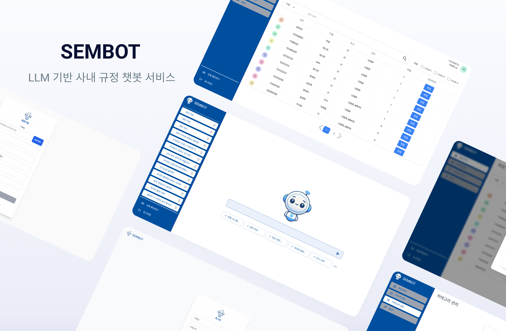

### SEMBOT - 사내 규정 챗봇 서비스

  <h1>SEMBOT - 사내 규정 챗봇 서비스</h1>
  
🔍 LLM 기반 사내 규정 챗봇 서비스 🔍

 

> **서비스 바로가기**: https://sembot.co.kr

  

 

  <a href="https://sembot.co.kr/">홈페이지</a>
  &nbsp; | &nbsp;
  <a href="http://k11s102.p.ssafy.io:8080/swagger-ui/index.html">Swagger</a>
  &nbsp; | &nbsp;
  <a href="https://season-poison-a39.notion.site/Project-1134ef984a1880afa035f50350278481?pvs=4">Notion</a>

---

## ✍️ 프로젝트 개요

- **프로젝트명:** SEMBOT
- **프로젝트 기간:** 2024.10 ~ 2024.11.19
- **프로젝트 형태:** 기업 연계 프로젝트
- **목표:** 기존 키워드 기반 챗봇의 한계를 극복하고, 사내 업무 규정 및 절차에 대한 정확하고 유연한 정보를 제공하는 LLM 기반 챗봇 서비스 개발
- **주요 타겟 사용자:** 사내 직원 (모든 직급과 부서)

---

## ✍️ 프로젝트 소개

### 프로젝트 배경

사내에서 업무 절차 및 규정을 확인하는 기존 프로세스는 다음과 같은 문제점이 있었습니다:

1. **비효율적인 정보 탐색:** 
   - 정보 확인을 위해 담당자와 직접 소통하거나 사내 포털에서 검색해야 함.
   - 검색 결과가 부정확하거나 원하는 정보를 찾는데 시간이 오래 걸림.

2. **기존 챗봇의 한계:** 
   - 키워드 기반으로 동작하여 복잡한 질문을 처리하지 못함.
   - 문맥 이해 부족으로 인해 답변의 유연성과 정확성이 낮음.

3. **규정 관리의 비효율성:** 
   - 신규 또는 변경된 규정을 즉시 반영하기 어려움.
   - 정형화되지 않은 규정 데이터 관리로 인해 최신 정보 제공이 어려움.

**SEMBOT**은 위 문제를 해결하기 위해 LLM(Large Language Model)과 RAG(Retrieval-Augmented Generation) 기술을 활용하여 자연어를 이해하고, 최신 규정 정보를 기반으로 신뢰도 높은 답변을 제공하는 서비스입니다.

---

### 문제점 해결

- **질문 처리의 유연성 증가:** 단순 키워드 매칭에서 벗어나 문맥과 의미를 이해하여 보다 자연스럽고 정확한 답변을 제공.
- **규정 업데이트 자동화:** 관리자 인터페이스를 통해 규정 데이터를 업데이트하면 벡터 데이터베이스가 자동으로 갱신되어 최신 정보를 실시간 제공.
- **사용자 맞춤형 정보 제공:** 사용자 계정의 권한 레벨에 따라 접근 가능한 정보를 제한하여 보안성 강화.

---

## 🚀 프로젝트 목표

1. **업무 효율성 향상:** 
   - 직원들이 필요한 정보를 신속히 얻을 수 있도록 함으로써 업무 시간 절약.
   - 담당자와의 직접 소통 및 검색 부담 완화.

2. **사용자 경험 강화:** 
   - 직관적이고 간편한 챗봇 인터페이스 제공.
   - 피드백 기능을 통해 지속적인 서비스 개선.

3. **확장 가능성 확보:** 
   - 규정 데이터의 지속적인 업데이트를 위한 자동화된 데이터 관리 기능 구현.
   - 향후 사내 타 시스템과의 연동 가능성을 고려한 설계.

---

## 📌 주요 기능

### **1. 자연어 이해를 통한 질문 응답**

- **기능 설명:** 사용자가 자연어로 질문을 입력하면, LLM이 질문의 문맥과 의미를 분석하여 적합한 답변을 제공합니다.
- **기술 요소:**
  - **RAG(Retrieval-Augmented Generation):** 유사도 기반 검색을 통해 관련 규정 데이터를 추출한 후, 답변에 포함.
  - **LLM 모델:** 한국어 성능에 최적화된 Llama-VARCO-8B 모델 사용.

  

---

### **2. 규정 업데이트 자동화**

- **기능 설명:** 관리자 페이지를 통해 신규 규정 작성 및 기존 규정 수정 시, 벡터 데이터베이스가 자동으로 갱신됩니다.
- **주요 과정:**
  1. 관리자가 규정을 입력하거나 수정.
  2. 변경 사항이 JSON 포맷으로 변환.
  3. 벡터 데이터베이스(Faiss)를 재구성하여 최신 데이터 반영.

  

---

### **3. 사용자 레벨 기반 정보 접근 제어**

- **기능 설명:** 직원의 직급과 부서에 따라 정보 접근 권한을 제한합니다.
- **예시:** 
  - 신입 직원은 일반적인 규정만 접근 가능.
  - 인사팀 직원은 민감한 인사 규정에도 접근 가능.

  

---

### **4. 피드백 기능**

- **기능 설명:** 사용자가 응답 품질에 대해 피드백을 남길 수 있으며, 이를 통해 챗봇의 학습 데이터가 개선됩니다.
- **주요 기능:** 
  - 응답 정확성 평가.
  - 추가 학습 데이터로 활용 가능.

  

---

## 🧑‍💻 팀원 소개

| **이름**    | **역할**        | 
|:-----------:|:---------------:|
| 변지환      | 팀장 & FE/BE    | 
| 김광현      | FE/BE           |
| 김상혁      | AI              | 
| 김준호      | AI              | 
| 이서빈      | BE/FE           | 
| 한수한      | FE/AI/Infra        | 

---

## ⚙️ 기술 스택

<table>
  <thead>
    <tr>
      <th>분류</th>
      <th>기술 스택</th>
    </tr>
  </thead>
  <tbody>
    <tr>
      <td>프론트엔드</td>
      <td>
        
        
        
        
      </td>
    </tr>
    <tr>
      <td>백엔드</td>
      <td>
        
        
        
        
      </td>
    </tr>
    <tr>
      <td>데이터베이스</td>
      <td>
        
        
        
      </td>
    </tr>
    <tr>
      <td>인프라</td>
      <td>
        
        
        
        
      </td>
    </tr>
  </tbody>
</table>

---

## 📂 문서 자료

- [포팅 메뉴얼](./exec/SEMBOT_포팅_메뉴얼.md)
- [시연 시나리오](./exec/시연_시나리오_S102.pdf)
- [발표 자료](./exec/최종_발표자료_S102.pdf)

---

